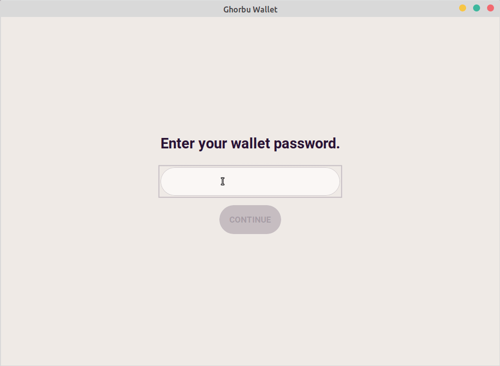

 

A cross-platform desktop HD wallet for Bitcoin.

 

 
 

## About
Ghorbu wallet is a hierarchical deterministic Bitcoin wallet for the desktop.
It implements [BIP-39](https://en.bitcoin.it/wiki/BIP_0039) (generating the mnemonic and converting it into a binary seed),
[BIP-32](https://en.bitcoin.it/wiki/BIP_0032) (deriving a tree of keypairs from a the seed and build a wallet structure), and
[BIP-44](https://en.bitcoin.it/wiki/BIP_0044) (defining a logical hierarchy for deterministic wallets).  
For the coin selection process, it uses the Random-Improve algorithm as specified in [CIP-2](https://cips.cardano.org/cips/cip2/).  
The wallet uses the [mempool.space REST API](https://mempool.space/docs/api/rest).  
The app is built using [Tauri](https://tauri.app/). The backend is written in Rust and the frontend is built with [Svelte](https://svelte.dev/).

## Download
Go [here](https://github.com/matthias-wright/ghorbu-wallet/releases).

## Build
1. Install the prerequisites: https://tauri.app/v1/guides/getting-started/prerequisites
2. `git clone https://github.com/matthias-wright/ghorbu-wallet.git`
3. `cd ghorbu-wallet`
4. `npm install`
5. `cargo install tauri-cli`
6. `cargo tauri build`

## References
* [Bitcoin Core](https://github.com/bitcoin/bitcoin)
* [BIPs](https://github.com/bitcoin/bips/blob/master/README.mediawiki)
* [Mastering Bitcoin (2nd Edition) by Andreas M. Antonopoulos](https://aantonop.com/books/mastering-bitcoin/)
* [Programming Bitcoin by Jimmy Song](https://programmingbitcoin.com/programming-bitcoin-book/)
* [CIP-2](https://cips.cardano.org/cips/cip2/)

## License
[GPL-3.0](https://opensource.org/licenses/GPL-3.0)
